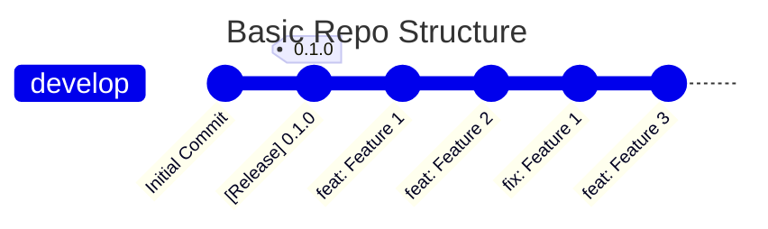
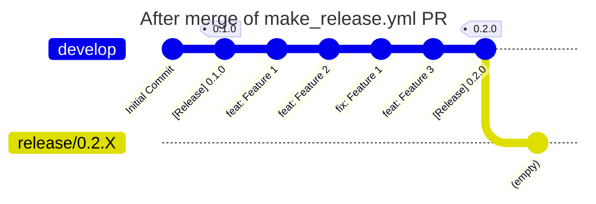
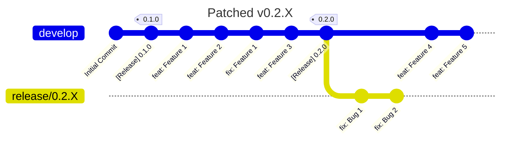
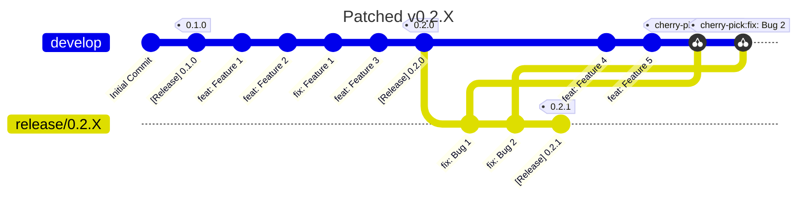

## Introduction

### Purpose
This document defines the versioning and release system intended for the Dissolve project.

### Scope
This document describes and continuous integration workflows present for handling versioning and releasing of the Dissolve project, suitable for developers.

## Overview

Dissolve follows the [semantic versioning](https://semver.org/) model.  Changes in the major release number (e.g. version 2 to version 3) indicate breaking changes that may invalidate old files.  Changes to the minor release number (e.g. version 1.12 to 1.13) indicate the addition of new features to the program.  Finally, changes in the patch number (e.g. version 1.4.1 to 1.4.2) indicate bug fixes and refactorings that do not fundamentally significantly change the behaviour of the program. Determining version changes is handled in a completely autonomous manner by the CI via git-cliff. The release branching strategy is separate branches for releases, with patches appended in those branches and back-merged into `develop` if required.

## 1. Daily Work Life (a.k.a. Continuous Builds)
A simple repo may look like this:

On merging of a (non-"[Release]") PR the standard `continuous.yml` workflow is in charge of building, packaging, and publishing the continuous version, but what version should this development release have? The main `develop` branch will still be labelled as the latest release "0.1.0" in the source code and configuration files, but the various feature additions and fixes will push this to "0.2.0". The `continuous.yml` workflow will dynamically change the versions accordingly when it runs (but not, of course, commit them back to the `develop` branch) and so every continuous release that gets published will consistently reflect the next release version number. We also get a ChangeLog reflecting all changes since the last release for free, and which is set as the body text of the release.

The first step in every workflow is the `_checkout.yml` action which retrieves the entire repository and bumps the version number with git-cliff if it is requested / necessary. The updated source code is then stored in a build artifact which is downloaded by other workflows when required (a copy of the original, unmodified source is also stored for the purposes of code formatting etc.). `_checkout.yml` also handles any re-tagging related to releases, and setting of various version parameters and hashes.

## 2. Making a Major/Minor Release
To prepare for a release the manual (workflow-dispatch) workflow `prepare_release.yml` is used. Upon running the workflow on the `develop` branch the new version of the code is determined (as the `continuous.yml` workflow does) but here the modified source code and configuration files committed back to `develop` through an auto-generated PR prefixed by "[Release]".  The idea here is to automate the determination of the next major/minor version, but using the PR as a barrier / choice as to whether to proceed or not, or whether a new release version is even valid / possible- if no changes to the version number with git-cliff are found it will simply fail and not create a release PR.

If successfully merged, the `detect_release.yml` workflow runs since it is triggered on closed PRs which were successfully merged _and_ whose title begins "[Release]". It's job is to set things up consistently in terms of tagging, and to subsequently generate and publish a full release. This action replaces the existing `release.yml` workflow, and performs the following tasks focussed on the PR merge commit in the `develop` branch:
1. Creates a new tag with the version number determined by `git-cliff` (via `./changeversion -q`).
2. Creates a new branch coming named `release/MAJOR.MINOR.X` if it doesn't already exist. This serves as the entry point for any patch releases to be made should they be required.

So, after all that the repository then looks like this:

(Note that there is no actual commit in the "release/0.2.X" - I just had to add one here to get Mermaid to correctly display the relationship with the PR merge commit on `develop`.)

One final point - following the successful merge of the "[Release]" PR back into `develop`, the `continuous.yml` will run as per normal, bringing the continuous release version also up-to-date with the latest production release.

## 3. Patching an Existing Release

Following the release of 0.2.X work on adding new features to `develop` carries on but we also discover and fix a bug and patch the `release/0.2.X` branch in a couple of commits:

 In order to push our new patch release we simply run `prepare_release.yml` on the `release/0.2.X` branch rather than `develop`. This will automatically re-version the source code and configuration files, create the tag, but not create the `release/0.2.X` branch because of course it already exists. The fixes can then be back-merged into `develop`, if they haven't been already, and the repo looks like this:
 

## 4. A Note on Version Checking

As noted earlier the `prepare_release.yml` script will bail out if it detects that the version has not changed between the current authoritative version in the source and that determined by git-cliff. In a similar manner, it will also fail if one tries to prepare a release on `develop` which is only a patch version, or conversely if one tries to prepare a release on a `release/?.?.X` branch that is _not_ a patch version.

## 5. Synchronisation with External-Facing Resources

The repository remains the single source of truth regarding the current version of Dissolve, and the principal dependent resource (https://www.projectdissolve.com) is updated via the CI when new releases occur.
